<!--  README — Guilherme Casanova — @Gcazi -->

<!-- ══════════════════ BANNER ══════════════════ -->

  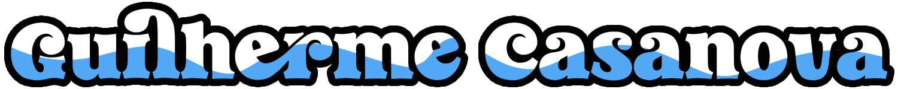

  

  <strong>Desenvolvedor Full Stack em Formação&nbsp; | &nbsp;Designer&nbsp; | &nbsp;Ilustrador</strong>
  

<!-- ══════════════════ TYPING 1 ══════════════════ -->

  

---

<!-- ══════════════════ INFO ══════════════════ -->

<table border="0" cellpadding="16" cellspacing="0">
<tr>

<td valign="top" width="58%">

### ✦ Olá, eu sou o Guilherme!

<table border="0" cellpadding="12" cellspacing="0">
<tr>
<td bgcolor="#111111" style="border-radius: 12px;">

✦ **Nome:** Guilherme Da Silva Casanova  
✦ **Usuário:** @Gcazi  
✦ **Local:** Rio de Janeiro, Brasil  
✦ **Curso:** Análise e Desenvolvimento de Sistemas  
✦ **Período:** 4º período — em andamento  
✦ **Objetivo:** Desenvolvedor Full Stack  

</td>
</tr>
</table>

</td>

<td valign="top" width="42%" align="center">

<!-- GIF/ANIMAÇÃO -->

 

<!-- CONTATOR VISITANTES -->

 

<!-- CONTATOR SEGUIDORES -->

</td>

</tr>
</table>

---

<!-- ══════════════════ TYPING 2 ══════════════════ -->

---

<!-- ══════════════════ SOBRE MIM ══════════════════ -->

<!-- Título -->

<!-- Avatar -->

<table align="center" border="0" cellpadding="8" cellspacing="0">

<tr>

<td valign="middle" width="20%" align="center">

</td>

<td valign="middle" width="80%">

<strong>Um pouco sobre mim, minha trajetória, interesses, objetivos e minha jornada na área de tecnologia.</strong>

</td>

</tr>

</table>

<!-- Texto -->

<td valign="middle" width="58%">

### ✦ Sobre mim 

Sou estudante de <strong>Análise e Desenvolvimento de Sistemas (ADS)</strong> e estou sempre buscando aprender, experimentar e evoluir na área de tecnologia. Gosto de transformar ideias em projetos e explorar novas possibilidades através da programação.

Além da tecnologia, a <strong>arte e a ilustração</strong> fazem parte importante de quem sou. Crio <strong>quadrinhos, ilustrações e projetos visuais</strong>, buscando unir criatividade e tecnologia em tudo que desenvolvo.

Também sou apaixonado por <strong>jogos retrô, videogames e mangás</strong>, especialmente <strong>Hunter x Hunter</strong>. Atualmente, estou aprimorando minhas habilidades em <strong>programação, design e arte</strong>, sempre buscando novos desafios e oportunidades para aprender.

<strong>✦ Interesses:</strong> Tecnologia • Programação • Design • Ilustração • Quadrinhos • Games • Mangás

</td>
 

<!-- Imagem decorativa -->

 

<!-- ══════════════════ MINHA JORNADA ══════════════════ -->

## Minha Jornada

<!-- Título -->

<!-- Lista -->

<table align="center" border="0" cellpadding="15" cellspacing="0">

<tr>

<td valign="top" width="30%">

### ✦ Minha trajetória ✦

 

<strong>✦ 01 · Aprender</strong>

 

<strong>✦ 02 · Praticar</strong>

 

<strong>✦ 03 · Criar</strong>

 

<strong>✦ 04 · Evoluir</strong>

</td>

<!-- Imagem -->

<td valign="middle" width="60%" align="center">

</td>

</tr>

</table>

<!-- Avatar -->

<table align="center" border="0" cellpadding="8" cellspacing="0">

<tr>

<td valign="middle" width="20%" align="center">

</td>

<td valign="middle" width="80%">

<strong>Uma trajetória construída através de aprendizado, prática, criatividade e evolução constante, transformando cada experiência em uma nova oportunidade para aprender, praticar, criar e evoluir.</strong>

</td>

</tr>

</table>

 

<!-- ══════════════════ PORTFÓLIO & PROJETOS ══════════════════ -->

## Portfólio & Projetos

<!-- Título -->

<!-- Avatar -->

<table align="center" border="0" cellpadding="8" cellspacing="0">

<tr>

<td valign="middle" width="20%" align="center">

</td>

<td valign="middle" width="80%">

<strong>Explore meus principais projetos e criações, desenvolvidos para colocar em prática meus conhecimentos, explorar novas tecnologias e transformar ideias em experiências. Clique nos ícones para conhecer cada projeto, suas ideias e tecnologias utilizadas.
</strong>

</td>

</tr>

</table>

<!-- Imagem decorativa -->

### ✦ Projetos & Portfólios ✦

<!-- Botões ícones -->

&nbsp;&nbsp;
&nbsp;&nbsp;
&nbsp;&nbsp;

 

<!-- ══════════════════ ARTE DECORATIVA ══════════════════ -->

  

 

<!-- ══════════════════ LABORATÓRIO CRIATIVO ══════════════════ -->

## Laboratório Criativo

<!-- Título -->

<!-- Avatar -->

<table align="center" border="0" cellpadding="8" cellspacing="0">

<tr>

<td valign="middle" width="20%" align="center">

</td>

<td valign="middle" width="80%">

<strong>Um espaço para experimentar, aprender e transformar curiosidade em criação, explorando conceitos, tecnologias e novas possibilidades através de pequenos projetos.</strong>

</td>

</tr>

</table>

<!-- Imagem decorativa -->

### ✦ Experimentos ✦

<strong>Testes • Estudos • Ideias</strong>

<!-- Botão -->

 

<!-- ══════════════════ ARTE DECORATIVA ══════════════════ -->

  

 

<!-- ══════════════════ FERRAMENTAS & TECNOLOGIAS ══════════════════ -->

## Ferramentas & Tecnologias

<!-- Título -->

<!-- Avatar -->

<table align="center" border="0" cellpadding="8" cellspacing="0">
<tr>

<td valign="middle" width="20%" align="center">

</td>

<td valign="middle" width="80%">

<strong>Ferramentas e tecnologias que fazem parte da minha jornada de aprendizado e desenvolvimento, reunindo conhecimentos que já domino, tecnologias que estou aprimorando e novas ferramentas que estou explorando.</strong>

</td>

</tr>
</table>

<!-- Badges -->

  
  &nbsp;
  
  &nbsp;
  

 

<!-- Biblioteca — Tecnologias & ferramentas -->

<table>
  <tr>
    <td align="center" width="110" height="110">
      
       
      <b>JavaScript</b>
    </td>
    <td align="center" width="110" height="110">
      
       
      <b>TypeScript</b>
    </td>
    <td align="center" width="110" height="110">
      
       
      <b>HTML5</b>
    </td>
    <td align="center" width="110" height="110">
      
       
      <b>CSS3</b>
    </td>
    <td align="center" width="110" height="110">
      
       
      <b>PHP</b>
    </td>
    <td align="center" width="110" height="110">
      
       
      <b>Python</b>
    </td>
    <td align="center" width="110" height="110">
      
       
      <b>Node.js</b>
    </td>
    <td align="center" width="110" height="110">
      
       
      <b>React</b>
    </td>
  </tr>
  <tr>
    <td align="center" width="110" height="110">
      
       
      <b>Next.js</b>
    </td>
    <td align="center" width="110" height="110">
      
       
      <b>Angular</b>
    </td>
    <td align="center" width="110" height="110">
      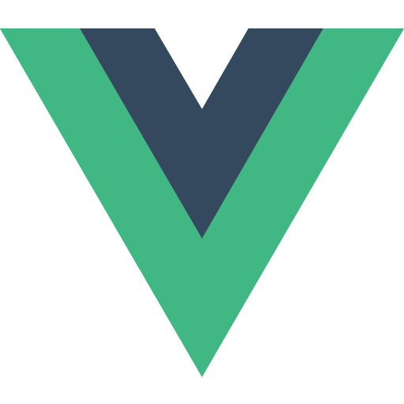
       
      <b>Vue</b>
    </td>
    <td align="center" width="110" height="110">
      
       
      <b>Sass</b>
    </td>
    <td align="center" width="110" height="110">
      
       
      <b>Tailwind</b>
    </td>
    <td align="center" width="110" height="110">
      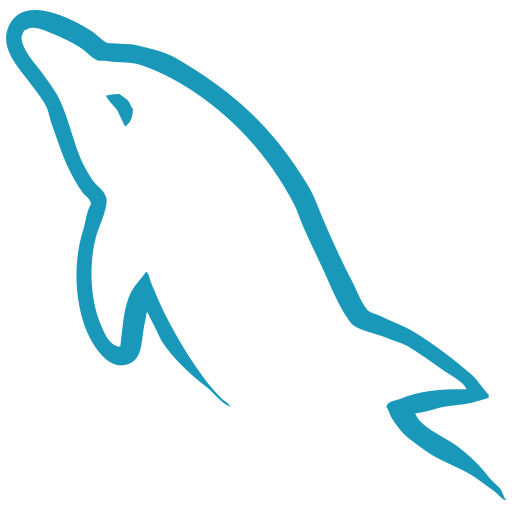
       
      <b>MySQL</b>
    </td>
    <td align="center" width="110" height="110">
      
       
      <b>PostgreSQL</b>
    </td>
    <td align="center" width="110" height="110">
      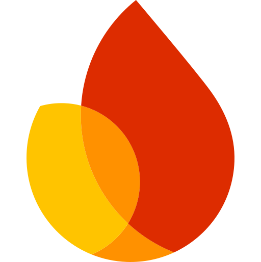
       
      <b>Firebase</b>
    </td>
  </tr>
  <tr>
    <td align="center" width="110" height="110">
      
       
      <b>XAMPP</b>
    </td>
    <td align="center" width="110" height="110">
      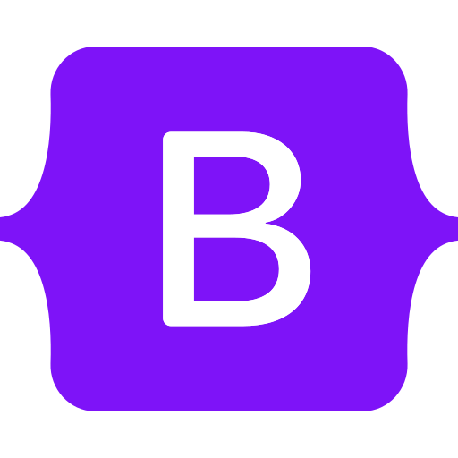
       
      <b>Bootstrap</b>
    </td>
    <td align="center" width="110" height="110">
      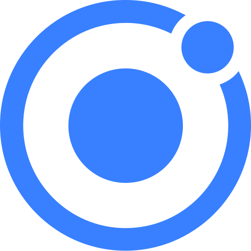
       
      <b>Ionic</b>
    </td>
    <td align="center" width="110" height="110">
      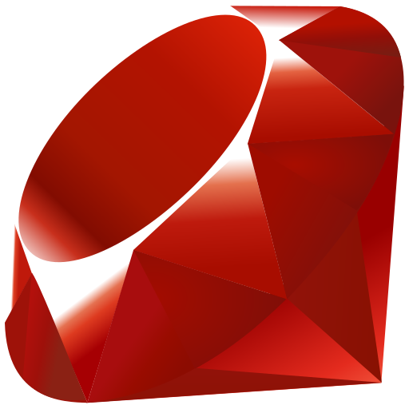
       
      <b>Ruby</b>
    </td>
    <td align="center" width="110" height="110">
      
       
      <b>Git</b>
    </td>
    <td align="center" width="110" height="110">
      
       
      <b>Linux</b>
    </td>
    <td align="center" width="110" height="110">
      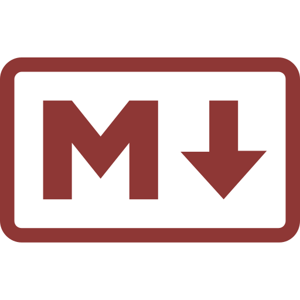
       
      <b>Markdown</b>
    </td>
    <td align="center" width="110" height="110">
      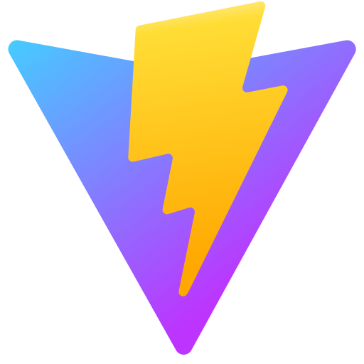
       
      <b>Vite</b>
    </td>
  </tr>
  <tr>
    <td align="center" width="110" height="110">
      
       
      <b>Copilot</b>
    </td>
    <td align="center" width="110" height="110">
      
       
      <b>VSCode</b>
    </td>
    <td align="center" width="110" height="110">
      
       
      <b>Android</b>
    </td>
    <td align="center" width="110" height="110">
      
       
      <b>Godot</b>
    </td>
    <td align="center" width="110" height="110">
      
       
      <b>Blender</b>
    </td>
    <td align="center" width="110" height="110">
      
       
      <b>Figma</b>
    </td>
    <td align="center" width="110" height="110">
      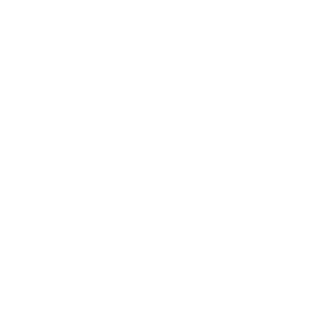
       
      <b>Penpot</b>
    </td>
    <td align="center" width="110" height="110">
      
       
      <b>Affinity</b>
    </td>
  </tr>
  <tr>
    <td align="center" width="110" height="110">
      
       
      <b>Behance</b>
    </td>
    <td align="center" width="110" height="110">
      
       
      <b>Ibis Paint X</b>
    </td>
    <td align="center" width="110" height="110">
      
       
      <b>Clip Studio</b>
    </td>
    <td align="center" width="110" height="110">
      
       
      <b>Krita</b>
    </td>
    <td align="center" width="110" height="110">
      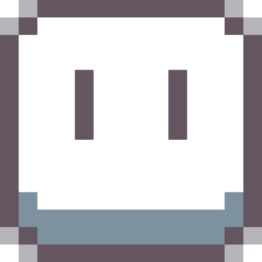
       
      <b>Aseprite</b>
    </td>
    <td align="center" width="110" height="110">
      
       
      <b>Notion</b>
    </td>
    <td align="center" width="110" height="110">
      
       
      <b>Trello</b>
    </td>
    <td align="center" width="110" height="110">
      
       
      <b>Lua</b>
    </td>
  </tr>
</table>
 

<!-- LOGOS ESPECIAIS (Maiores — Wordmarks) -->

&nbsp;&nbsp;
&nbsp;&nbsp;
&nbsp;&nbsp;

---

<!-- ══════════════════ GITHUB STATS ══════════════════ -->

## GitHub Stats

<!-- Título -->

 

<!-- Badge stats -->

  

---

<!-- ══════════════════ ARTE & ILUSTRACAO ══════════════════ -->

## Arte & Ilustração

<!-- Título -->

<!-- Avatar -->

<table align="center" border="0" cellpadding="8" cellspacing="0">

<tr>

<td valign="middle" width="20%" align="center">

</td>

<td valign="middle" width="80%">

<strong>Além da programação, a arte também faz parte da minha jornada. Exploro ilustração, quadrinhos e pixel art como formas de expressão e criatividade, desenvolvendo projetos visuais e aprimorando constantemente minhas habilidades artísticas.</strong>

</td>

</tr>

</table>

<!-- Nome instagram -->

 

<!-- ícone instagram -->

 

<!-- ══════════════════ ARTE DECORATIVA ══════════════════ -->

  

 

<!-- ══════════════════ CONTATOS ══════════════════ -->

## Contatos

<!-- Título -->

<!-- Avatar -->

<table align="center" border="0" cellpadding="8" cellspacing="0">
<tr>

<td valign="middle" width="20%" align="center">

</td>

<td valign="middle" width="80%">

<strong>Quer entrar em contato comigo? Clique em um dos ícones abaixo para encontrar minhas redes e canais de contato.</strong>

</td>

</tr>
</table>

<!-- Botões ícones -->

  
  &nbsp;&nbsp;
  
  &nbsp;&nbsp;
  

 

<!-- ══════════════════ BANDEIRAS / IDIOMA ══════════════════ -->

## Idioma

<!-- Título -->

<!-- Bandeiras -->

  <a href="README.md">
    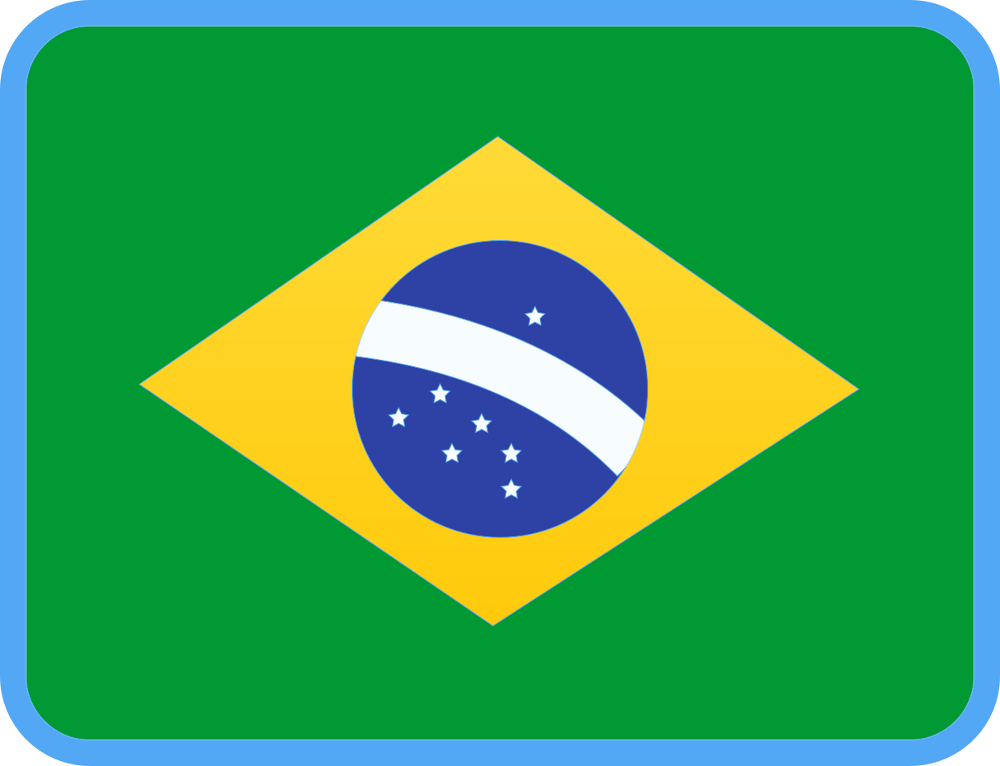
  </a>
  &nbsp;&nbsp;
  <a href="README_EN.md">
    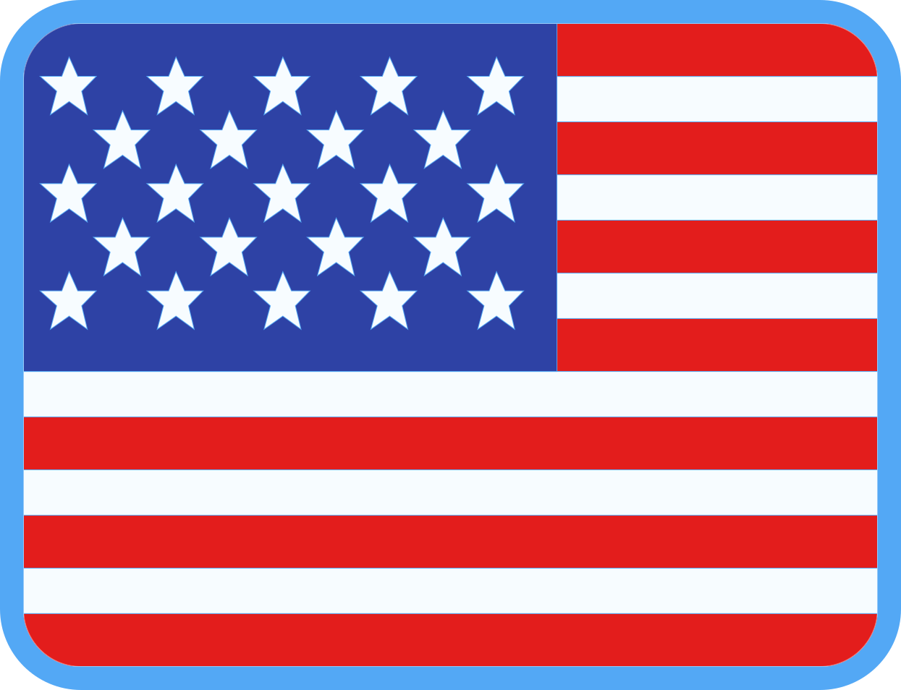
  </a>

---

<!-- ══════════════════ FOOTER ══════════════════ -->

 
  Feito com dedicação por <strong>Guilherme Casanova</strong> · <a href="https://github.com/Gcazi">@Gcazi</a>
   
  <em>"Cada dia me superando."</em>

---

<!-- ══════════════════ ARTE DECORATIVA ══════════════════ -->

 

  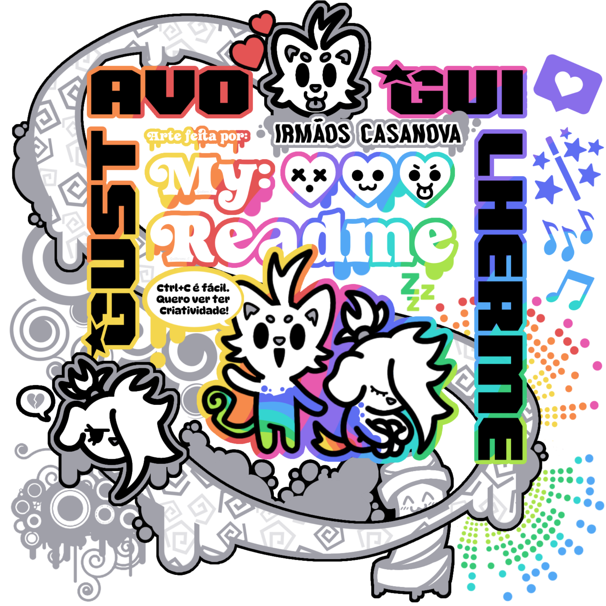

