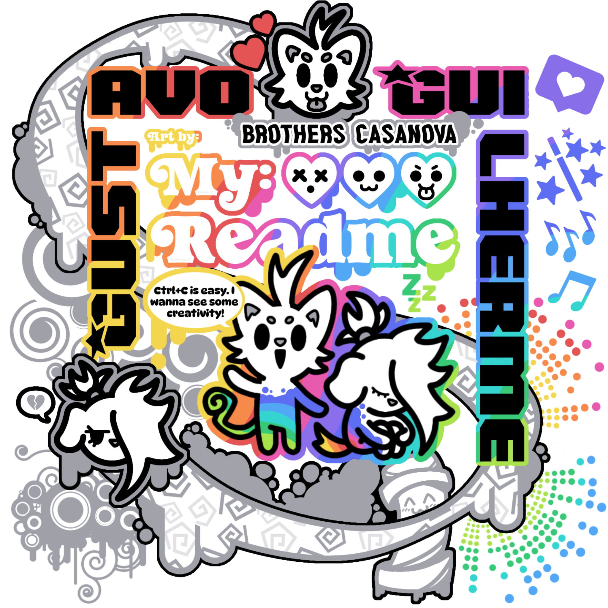

<!--  README_EN — Guilherme Casanova — @Gcazi — English Version -->

<!-- ══════════════════ BANNER ══════════════════ -->

  

  

  <strong>Full Stack Developer in Progress&nbsp; | &nbsp;Designer&nbsp; | &nbsp;Illustrator</strong>
  

<!-- ══════════════════ TYPING 1 ══════════════════ -->

  

---

<!-- ══════════════════ INFO ══════════════════ -->

<table border="0" cellpadding="16" cellspacing="0">
<tr>

<td valign="top" width="58%">

### ✦ Hello, I'm Guilherme!

<table border="0" cellpadding="12" cellspacing="0">
<tr>
<td bgcolor="#111111" style="border-radius: 12px;">

✦ **Name:** Guilherme Da Silva Casanova  
✦ **Username:** @Gcazi  
✦ **Location:** Rio de Janeiro, Brazil  
✦ **Course:** Systems Analysis and Development  
✦ **Semester:** 4th semester — in progress  
✦ **Goal:** Full Stack Developer  

</td>
</tr>
</table>

</td>

<td valign="top" width="42%" align="center">

<!-- GIF/ANIMATION -->

 

<!-- VISITOR COUNTER -->

 

<!-- FOLLOWER COUNTER -->

</td>

</tr>
</table>

---

<!-- ══════════════════ TYPING 2 ══════════════════ -->

---

<!-- ══════════════════ ABOUT ME ══════════════════ -->

<!-- Title -->

<!-- Avatar -->

<table align="center" border="0" cellpadding="8" cellspacing="0">

<tr>

<td valign="middle" width="20%" align="center">

</td>

<td valign="middle" width="80%">

<strong>A little about myself, my journey, interests, goals, and my path in the technology field.</strong>

</td>

</tr>

</table>

<!-- Text -->

<td valign="middle" width="58%">

### ✦ About Me 

I am a <strong>Systems Analysis and Development (ADS)</strong> student who is always looking to learn, experiment, and grow in the technology field. I enjoy turning ideas into projects and exploring new possibilities through programming.

Beyond technology, <strong>art and illustration</strong> are an important part of who I am. I create <strong>comics, illustrations, and visual projects</strong>, seeking to combine creativity and technology in everything I develop.

I am also passionate about <strong>retro games, video games, and manga</strong>, especially <strong>Hunter x Hunter</strong>. Currently, I am improving my skills in <strong>programming, design, and art</strong>, always looking for new challenges and opportunities to learn.

<strong>✦ Interests:</strong> Technology • Programming • Design • Illustration • Comics • Games • Manga

</td>
 

<!-- Decorative image -->

 

<!-- ══════════════════ MY JOURNEY ══════════════════ -->

## My Journey

<!-- Title -->

<!-- List -->

<table align="center" border="0" cellpadding="15" cellspacing="0">

<tr>

<td valign="top" width="30%">

### ✦ My Path ✦

 

<strong>✦ 01 · Learn</strong>

 

<strong>✦ 02 · Practice</strong>

 

<strong>✦ 03 · Create</strong>

 

<strong>✦ 04 · Evolve</strong>

</td>

<!-- Image -->

<td valign="middle" width="60%" align="center">

</td>

</tr>

</table>

<!-- Avatar -->

<table align="center" border="0" cellpadding="8" cellspacing="0">

<tr>

<td valign="middle" width="20%" align="center">

</td>

<td valign="middle" width="80%">

<table border="0" cellpadding="15" cellspacing="0">

<tr>

<td>

<strong>A path built through learning, practice, creativity, and constant evolution, turning every experience into a new opportunity to learn, practice, create, and evolve.
</strong>

</td>

</tr>

</table>

</td>

</tr>

</table>

 

<!-- ══════════════════ PORTFOLIO & PROJECTS ══════════════════ -->

## Portfolio & Projects

<!-- Title -->

<!-- Avatar -->

<table align="center" border="0" cellpadding="8" cellspacing="0">

<tr>

<td valign="middle" width="20%" align="center">

</td>

<td valign="middle" width="80%">

<strong>Explore my main projects and creations, developed to put my knowledge into practice, explore new technologies, and turn ideas into experiences. Click the icons to learn about each project, its ideas, and the technologies used.
</strong>

</td>

</tr>

</table>

<!-- Decorative image -->

### ✦ Projects & Portfolios ✦

<!-- Icon buttons -->

<table align="center" border="0" cellpadding="4" cellspacing="0">
<tr>

<td align="center">

</td>

<td align="center">

</td>

<td align="center">

</td>

<td align="center">

</td>

</tr>
</table>

 

<!-- ══════════════════ DECORATIVE ART ══════════════════ -->

  

 

<!-- ══════════════════ CREATIVE LABORATORY ══════════════════ -->

## Creative Laboratory

<!-- Title -->

<!-- Avatar -->

<table align="center" border="0" cellpadding="8" cellspacing="0">
<tr>

<td valign="middle" width="20%" align="center">

</td>

<td valign="middle" width="80%">

<table border="0" cellpadding="15" cellspacing="0">
<tr>
<td>

<strong>A space to experiment, learn, and turn curiosity into creation, exploring concepts, technologies, and new possibilities through small projects.
</strong>

</td>
</tr>
</table>

</td>

</tr>
</table>

<table align="center" border="0" cellpadding="12" cellspacing="0">
<tr>

<td valign="top" width="25%" align="center">

<!-- Decorative image -->

### ✦ Experiments ✦

<strong>Tests • Studies • Ideas</strong>

</td>

</tr>
</table>

<!-- Button -->

 

<!-- ══════════════════ DECORATIVE ART ══════════════════ -->

  

 

<!-- ══════════════════ TOOLS & TECHNOLOGIES ══════════════════ -->

## Tools & Technologies

<!-- Title -->

<!-- Avatar -->

<table align="center" border="0" cellpadding="8" cellspacing="0">
<tr>

<td valign="middle" width="20%" align="center">

</td>

<td valign="middle" width="80%">

<strong>Tools and technologies that are part of my learning and development journey, gathering knowledge I've already mastered, technologies I'm improving, and new tools I'm exploring.</strong>

</td>

</tr>
</table>

<!-- Badges -->

  
  &nbsp;
  
  &nbsp;
  

 

<!-- Library — Technologies & tools -->

<table>
  <tr>
    <td align="center" width="110" height="110">
      
       
      <b>JavaScript</b>
    </td>
    <td align="center" width="110" height="110">
      
       
      <b>TypeScript</b>
    </td>
    <td align="center" width="110" height="110">
      
       
      <b>HTML5</b>
    </td>
    <td align="center" width="110" height="110">
      
       
      <b>CSS3</b>
    </td>
    <td align="center" width="110" height="110">
      
       
      <b>PHP</b>
    </td>
    <td align="center" width="110" height="110">
      
       
      <b>Python</b>
    </td>
    <td align="center" width="110" height="110">
      
       
      <b>Node.js</b>
    </td>
    <td align="center" width="110" height="110">
      
       
      <b>React</b>
    </td>
  </tr>
  <tr>
    <td align="center" width="110" height="110">
      
       
      <b>Next.js</b>
    </td>
    <td align="center" width="110" height="110">
      
       
      <b>Angular</b>
    </td>
    <td align="center" width="110" height="110">
      
       
      <b>Vue</b>
    </td>
    <td align="center" width="110" height="110">
      
       
      <b>Sass</b>
    </td>
    <td align="center" width="110" height="110">
      
       
      <b>Tailwind</b>
    </td>
    <td align="center" width="110" height="110">
      
       
      <b>MySQL</b>
    </td>
    <td align="center" width="110" height="110">
      
       
      <b>PostgreSQL</b>
    </td>
    <td align="center" width="110" height="110">
      
       
      <b>Firebase</b>
    </td>
  </tr>
  <tr>
    <td align="center" width="110" height="110">
      
       
      <b>XAMPP</b>
    </td>
    <td align="center" width="110" height="110">
      
       
      <b>Bootstrap</b>
    </td>
    <td align="center" width="110" height="110">
      
       
      <b>Ionic</b>
    </td>
    <td align="center" width="110" height="110">
      
       
      <b>Ruby</b>
    </td>
    <td align="center" width="110" height="110">
      
       
      <b>Git</b>
    </td>
    <td align="center" width="110" height="110">
      
       
      <b>Linux</b>
    </td>
    <td align="center" width="110" height="110">
      
       
      <b>Markdown</b>
    </td>
    <td align="center" width="110" height="110">
      
       
      <b>Vite</b>
    </td>
  </tr>
  <tr>
    <td align="center" width="110" height="110">
      
       
      <b>Copilot</b>
    </td>
    <td align="center" width="110" height="110">
      
       
      <b>VSCode</b>
    </td>
    <td align="center" width="110" height="110">
      
       
      <b>Android</b>
    </td>
    <td align="center" width="110" height="110">
      
       
      <b>Godot</b>
    </td>
    <td align="center" width="110" height="110">
      
       
      <b>Blender</b>
    </td>
    <td align="center" width="110" height="110">
      
       
      <b>Figma</b>
    </td>
    <td align="center" width="110" height="110">
      
       
      <b>Penpot</b>
    </td>
    <td align="center" width="110" height="110">
      
       
      <b>Affinity</b>
    </td>
  </tr>
  <tr>
    <td align="center" width="110" height="110">
      
       
      <b>Behance</b>
    </td>
    <td align="center" width="110" height="110">
      
       
      <b>Ibis Paint X</b>
    </td>
    <td align="center" width="110" height="110">
      
       
      <b>Clip Studio</b>
    </td>
    <td align="center" width="110" height="110">
      
       
      <b>Krita</b>
    </td>
    <td align="center" width="110" height="110">
      
       
      <b>Aseprite</b>
    </td>
    <td align="center" width="110" height="110">
      
       
      <b>Notion</b>
    </td>
    <td align="center" width="110" height="110">
      
       
      <b>Trello</b>
    </td>
    <td align="center" width="110" height="110">
      
       
      <b>Lua</b>
    </td>
  </tr>
</table>
 

<!-- SPECIAL LOGOS (Larger — Wordmarks) -->

&nbsp;&nbsp;
&nbsp;&nbsp;
&nbsp;&nbsp;

---

<!-- ══════════════════ GITHUB STATS ══════════════════ -->

## GitHub Stats

<!-- Title -->

 

<!-- Stats badge -->

  

---

<!-- ══════════════════ ART & ILLUSTRATION ══════════════════ -->

## Art & Illustration

<!-- Title -->

<!-- Avatar -->

<table align="center" border="0" cellpadding="8" cellspacing="0">

<tr>

<td valign="middle" width="20%" align="center">

</td>

<td valign="middle" width="80%">

<strong>Beyond programming, art is also part of my journey. I explore illustration, comics, and pixel art as forms of expression and creativity, developing visual projects and constantly improving my artistic skills.</strong>

</td>

</tr>

</table>

<!-- Instagram name -->

 

<!-- Instagram icon -->

 

<!-- ══════════════════ DECORATIVE ART ══════════════════ -->

  

 

<!-- ══════════════════ CONTACT ══════════════════ -->

## Contact

<!-- Title -->

<!-- Avatar -->

<table align="center" border="0" cellpadding="8" cellspacing="0">
<tr>

<td valign="middle" width="20%" align="center">

</td>

<td valign="middle" width="80%">

<strong>Want to get in touch with me? Click one of the icons below to find my social networks and contact channels.</strong>

</td>

</tr>
</table>

<!-- Icon buttons -->

  
  &nbsp;&nbsp;
  
  &nbsp;&nbsp;
  

 

<!-- ══════════════════ FLAGS / LANGUAGE ══════════════════ -->

## Language

<!-- Title -->

<!-- Flags -->

  
  &nbsp;&nbsp;
  

---

<!-- ══════════════════ FOOTER ══════════════════ -->

 
  Made with dedication by <strong>Guilherme Casanova</strong> · <a href="https://github.com/Gcazi">@Gcazi</a>
   
  <em>"Improving myself every day."</em>

---

<!-- ══════════════════ DECORATIVE ART ══════════════════ -->

 

  

